# Omni-Guard: Runtime Formal Verification for Embodied Agents

**Omni-Guard** is a neuro-symbolic safety layer designed for Generative AI agents in critical industrial environments (Digital Twins, Logistics, Robotics).

Unlike standard "Constitutional AI" which relies on prompt engineering, Omni-Guard uses a **Runtime Verification Kernel** backed by the **Z3 Theorem Prover**. It translates natural language safety constraints into formal logic on-the-fly, guaranteeing **0% violation rates** even when the underlying LLM hallucinates dangerous plans.

## 🚀 Key Features
* **Grammar-Constrained Safety:** LLMs cannot "hallucinate" code; they instantiate pre-verified physics templates.
* **Mathematical Guarantees:** Uses Satisfiability Modulo Theories (SMT) to prove safety before execution.
* **Zero-Shot Adaptation:** Users can define new safety rules (e.g., "Avoid Port A") in English, and the system compiles them into logic instantly.

## 🛠️ System Architecture

```mermaid
graph TD
    User([Human Operator]) -->|Instruction: 'Avoid Port A'| Parser(Semantic Parser / LLM)
    Parser -->|Template: AVOID_LOCATION| Compiler{Omni-Guard Compiler}
    
    subgraph "The Logic Kernel"
    Compiler -->|Formal Logic| Z3[Z3 Solver]
    Physics[Digital Twin Constraints] -->|Graph Topology| Z3
    end
    
    Agent[AI Agent] -->|Proposed Trajectory| Z3
    Z3 -->|Verification Check| Decision{Is Safe?}
    
    Decision -->|✅ Yes| Execute[Execute Action]
    Decision -->|🛑 No| Block[Block & Retry]
    Block --> Agent
```

1. Semantic Parser: Maps natural language to a constraint grammar.
2. Logic Compiler: Synthesizes Z3 assertions from the grammar.
3. Digital Twin: Simulates a scale-free logistics network (NetworkX).
4. Verifier: Rejects any action plan that contradicts the safety theorems.
# Results:
| Complexity | LLM Success Rate | Omni-Guard Safety Rate | Latency |
| :--- | :--- | :--- | :--- |
| Low (10 nodes) | 85% | **100%** | 12ms |
| High (50 nodes) | 62% | **100%** | 45ms |
 
# 1. Clone the repository
git clone [https://github.com/saimahesh8752/OmniGuard.git](https://github.com/saimahesh8752/OmniGuard.git)

# 2. Install dependencies
pip install z3-solver networkx

# 3. Run the Stress Test
python -m experiments.run_stress_test

🔗 Citation
If you use this framework, please cite:

Sai Mahesh Sandeboina, "Thinking Fast and Verified: Neuro-Symbolic Guardrails for Embodied Intelligence," 2025.
